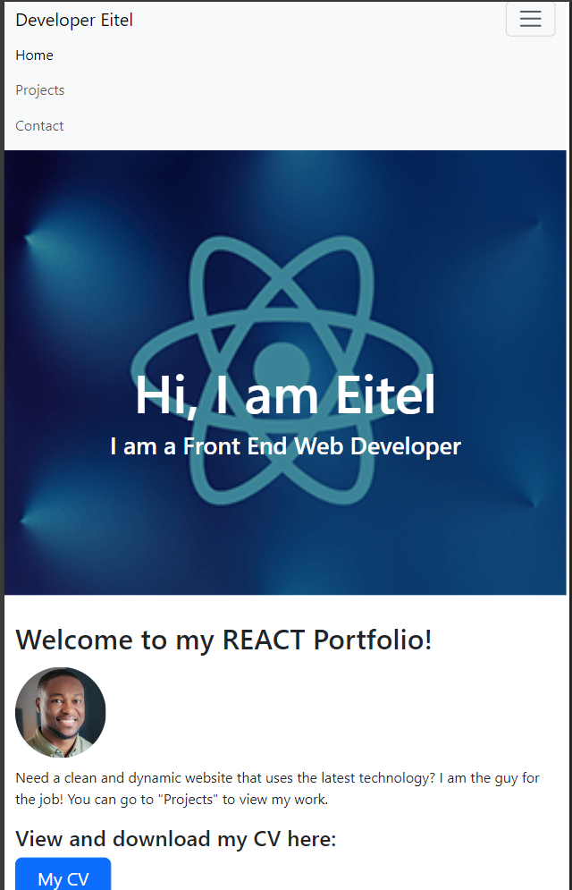
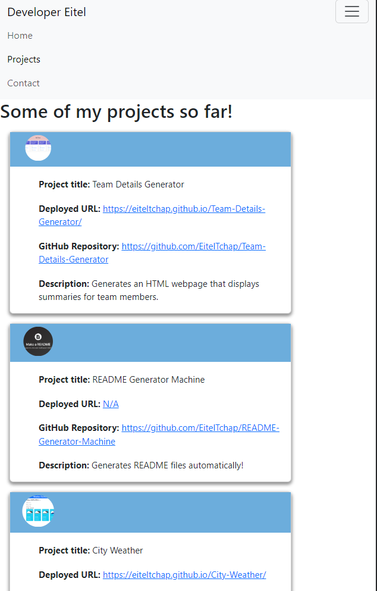
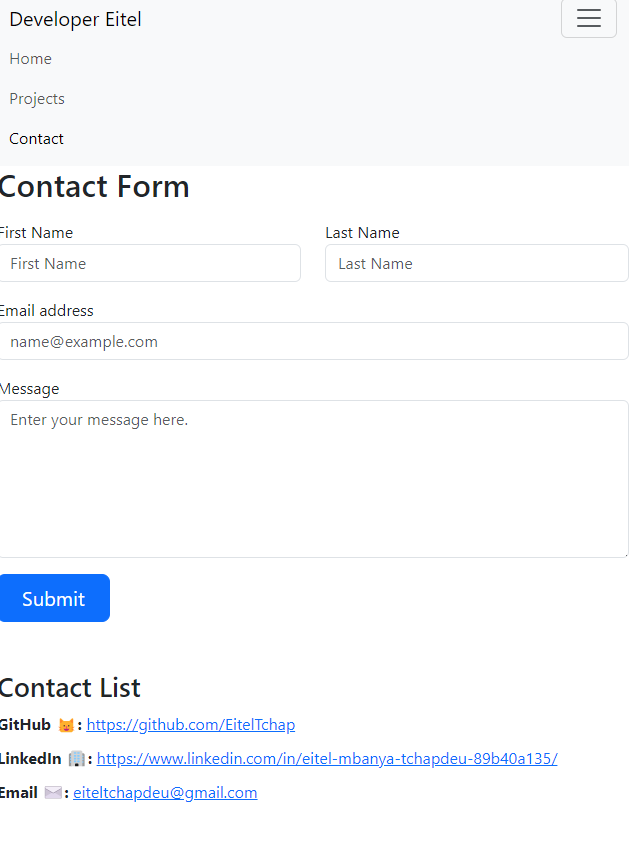

  
# Eitel React Portfolio

## Description 

This is an initial scaffolding for my portfolio site using React. It provides information on the projects I have done so far, my contact details, a contact form to reach out and my profile picture.

URL: https://eiteltchap.github.io/Eitel-React-Portfolio/

## Table of Contents

* [Installation](#installation)
* [Usage](#usage)
* [License](#license)
* [Contributions](#Contributions)
* [Test](#Test)

## Installation

Technology required to run the app are Nodejs and React.

## Usage 

To showcase my portfolio on a live website.

* Mock up
    * Home Page

    * Projects

    * Contact

## License

The license used is: M

## Contributions

N/A.

## Tests

N/A.

---

© Eitel production. All Rights Reserved.